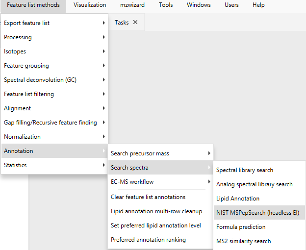
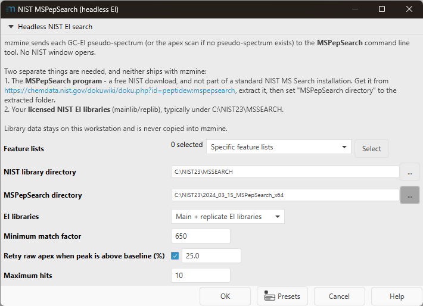

# NIST MSPepSearch setup

Headless NIST EI library searching in mzmine. No NIST window opens, and batch processing works.

**If you do not have NIST, ignore this page.** mzmine runs normally without it; the NIST module is
the only part that cares.

## What you need

| | Where it comes from |
|---|---|
| **NIST EI libraries** (`mainlib` / `replib`) | Your own licensed NIST installation, typically `C:\NIST23\MSSEARCH` |
| **MSPepSearch program** | Included in the mzmine installer. Nothing to do. |

MSPepSearch is a free NIST download that is *not* part of a standard NIST MS Search installation,
which is why mzmine ships it. If your build does not include it, get it from
<https://chemdata.nist.gov/dokuwiki/doku.php?id=peptidew:mspepsearch>, extract it anywhere, and
point the **MSPepSearch directory** parameter at the extracted folder.

## Opening the module

**Feature list methods → Annotation → Search spectra → NIST MSPepSearch (headless EI)**

## Settings

**NIST library directory** is the only setting you normally need to change. Point it at your NIST
installation. Either level works, so `C:\NIST23` and `C:\NIST23\MSSEARCH` both resolve.

**MSPepSearch directory** can usually be left alone. It searches the folder you pick, an
`nist_mspepsearch` subfolder, and any immediate subfolder, so a NIST root such as `C:\NIST23`
resolves the date-stamped folder NIST extracts to (for example `2024_03_15_MSPepSearch_x64`). When
several copies exist the newest release folder wins. If the field is empty, the copy bundled with
mzmine is used.

Remaining settings:

- **EI libraries** - search `mainlib`, `replib`, or both.
- **Minimum match factor** - NIST match factor (0-999) below which hits are discarded.
- **Retry raw apex when peak is above baseline (%)** - if a deconvoluted pseudo-spectrum returns no
  qualifying hit, retry the raw apex scan, but only for peaks at least this far above the local
  baseline. Speeds up batch runs without filtering the initial search.
- **Maximum hits** - how many hits to store per feature row.

The module needs a feature list, so import data and run feature detection first. To search a single
peak instead, right-click it in Raw Data Overview and choose **Run NIST search at clicked peak
apex**.

## Results

Stored hits appear in the **NIST matches** tab in the main window, and can be drawn as compound
labels directly on the chromatogram in Raw Data Overview. Labels are off by default.

## Troubleshooting

**"MSPepSearch64.exe was not found"** - the folder has no MSPepSearch. Download it from the link
above and point the parameter at the extracted folder. Keep `MSPepSearch64.exe` together with
`ctnt66a64.dll`, `dForm64.dll`, `nistdl64a.dll` and `zlib1_x64.dll`; it will not start without them.

**"NIST mainlib was not found under ..."** - the library directory is wrong. It must contain a
`mainlib` folder (and `replib` if replicate libraries are selected).

**Search completes but finds nothing** - check the mzmine log. Each run records which executable and
libraries it used, so you can confirm the intended installation was searched. A warning about
unrecognized column titles means the installed MSPepSearch build reports results in a format mzmine
did not recognize.
