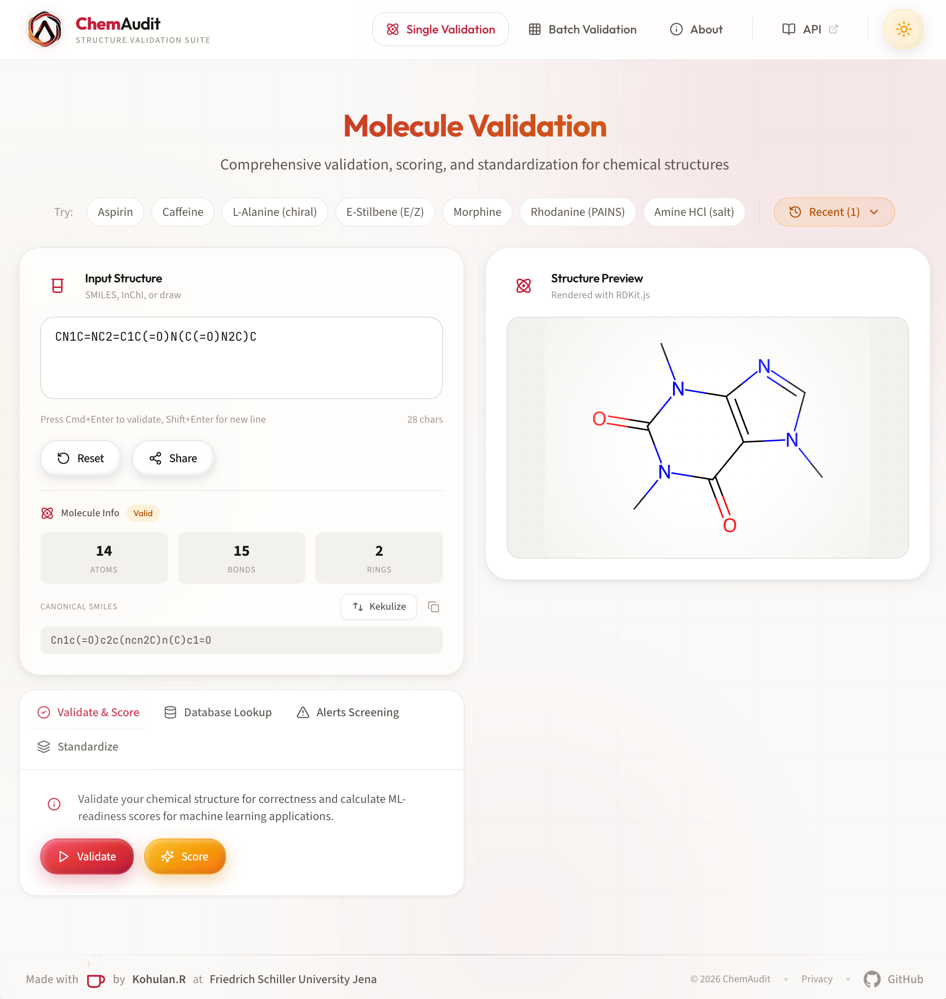
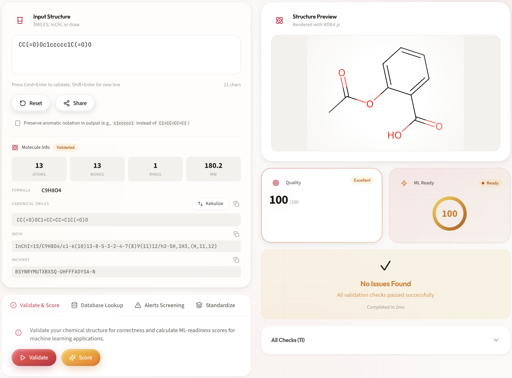
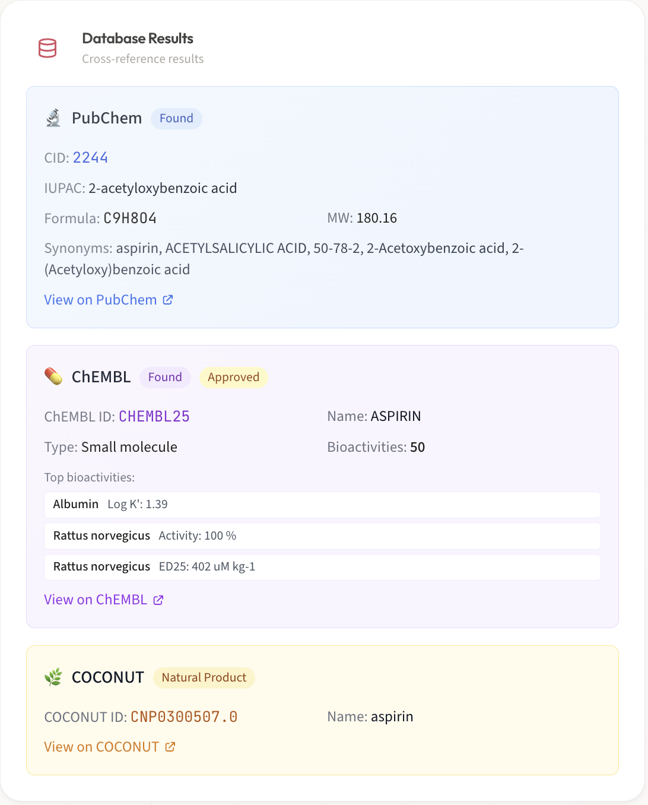

<div align="center">


### Chemical Structure Validation & Quality Assessment Platform

[](https://opensource.org/licenses/MIT)
[](https://github.com/Kohulan/ChemAudit/releases)
[](https://github.com/Kohulan/ChemAudit/actions/workflows/test.yml)
[](https://kohulan.github.io/ChemAudit/)
[](https://github.com/Kohulan/ChemAudit/graphs/contributors)
[](https://github.com/Kohulan/ChemAudit/issues)
[](https://www.python.org/downloads/)
[](https://reactjs.org/)
[](https://fastapi.tiangolo.com/)
[](https://www.rdkit.org/)
[](https://www.docker.com/)

<br />

**Validate • Standardize • Score • Analyze**

*A powerful web platform for cheminformatics workflows, drug discovery, and ML dataset curation*

[Features](#-features) •
[Quick Start](#-quick-start) •
[Documentation](https://www.kohulanr.com/ChemAudit/) •
[API](#-api-reference) •
[Contributing](#-contributing)

<br />



</div>

---

## ✨ Features

<table>
<tr>
<td width="50%">

### 🔬 Structure Validation
Comprehensive chemical structure analysis with 15+ validation checks

- Valence & connectivity errors
- Aromaticity & kekulization
- Stereochemistry validation
- Ring system analysis
- Atom & bond type verification

</td>
<td width="50%">

### ⚠️ Structural Alerts
Screen compounds against known problematic substructures

- **PAINS** - Pan-Assay Interference detection
- **BRENK** - Unwanted group filters
- **Custom Catalogs** - Define your own rules
- Severity scoring & recommendations

</td>
</tr>
<tr>
<td width="50%">

### 📊 ML-Readiness Scoring
Evaluate compound suitability for machine learning

- Descriptor calculability assessment
- Fingerprint generation validation
- Molecular complexity scoring
- Dataset quality metrics

</td>
<td width="50%">

### 🌿 Natural Product Analysis
Assess natural product-likeness characteristics

- NP-Likeness scoring algorithm
- Scaffold extraction & classification
- Structural similarity to known NPs
- Biosynthetic pathway hints

</td>
</tr>
<tr>
<td width="50%">

### 🧹 Standardization Pipeline
ChEMBL-compatible molecular standardization

- Salt stripping & neutralization
- Tautomer canonicalization
- Stereochemistry normalization
- Configurable pipeline steps

</td>
<td width="50%">

### 🗄️ Database Integrations
Cross-reference against major chemical databases

- **PubChem** - Compound properties & synonyms
- **ChEMBL** - Bioactivity & target data
- **COCONUT** - Natural products database

</td>
</tr>
</table>

---

## 🚀 Quick Start

### Using Docker (Recommended)

```bash
# Clone the repository
git clone https://github.com/Kohulan/ChemAudit.git
cd chemaudit

# Start all services (development)
docker-compose up -d

# View logs
docker-compose logs -f
```

🌐 **Access Points:**
| Service | URL |
|---------|-----|
| Web UI | http://localhost:3002 |
| API Docs | http://localhost:8001/docs |
| Metrics | http://localhost:9090 |

### Production Deployment

Use the interactive deploy script to select a deployment profile:

```bash
# Interactive mode - shows profile menu
./deploy.sh

# Or specify profile directly
./deploy.sh medium
```

**Available Profiles:**

| Profile | Max Molecules | Max File Size | Workers | Use Case |
|---------|---------------|---------------|---------|----------|
| `small` | 1,000 | 100 MB | 2 | Development |
| `medium` | 10,000 | 500 MB | 4 | Standard production |
| `large` | 50,000 | 500 MB | 8 | High-throughput |
| `xl` | 100,000 | 1 GB | 12 | Enterprise |
| `coconut` | 1,000,000 | 1 GB | 16 | Full COCONUT DB |

See [Deployment Guide](docs/DEPLOYMENT.md) for detailed configuration.

### Manual Installation

<details>
<summary><b>Backend Setup</b></summary>

```bash
cd backend
poetry install
poetry run uvicorn app.main:app --reload
```

</details>

<details>
<summary><b>Frontend Setup</b></summary>

```bash
cd frontend
npm install
npm run dev
```

</details>

---

## 📸 Screenshots

<div align="center">
<table>
<tr>
<td align="center"><b>Single Molecule Validation</b></td>
<td align="center"><b>Batch Processing</b></td>
</tr>
<tr>
<td></td>
<td></td>
</tr>
<tr>
<td align="center"><b>Scoring Dashboard</b></td>
<td align="center"><b>Database Lookup</b></td>
</tr>
<tr>
<td></td>
<td></td>
</tr>
</table>
</div>

---

## 📦 Batch Processing

Process large datasets with ease:

| Feature | Specification |
|---------|---------------|
| **Max File Size** | Up to 1 GB (profile-dependent) |
| **Max Molecules** | Up to 1,000,000 per batch (profile-dependent) |
| **Supported Formats** | SDF, CSV |
| **Progress Tracking** | Real-time WebSocket updates |
| **Export Formats** | CSV, JSON, Excel, SDF, PDF Report |

> **Note:** Batch limits are dynamically configured based on your deployment profile.
> The frontend automatically displays the correct limits for your deployment.

```python
# Python client example
from chemaudit import ChemAuditClient

client = ChemAuditClient("http://localhost:8000")

# Upload and process
job = client.upload_batch("molecules.sdf")

# Monitor progress
for update in client.stream_progress(job.job_id):
    print(f"Progress: {update.progress}%")

# Get results
results = client.get_results(job.job_id)
```

---

## 🛠️ Tech Stack

<div align="center">

| Layer | Technologies |
|-------|-------------|
| **Frontend** |     |
| **Backend** |     |
| **Database** |   |
| **Infrastructure** |   |
| **Monitoring** |   |

</div>

---

## 📖 Documentation

| Document | Description |
|----------|-------------|
| [Getting Started](docs/GETTING_STARTED.md) | Installation and first steps |
| [User Guide](docs/USER_GUIDE.md) | Complete usage instructions |
| [API Reference](docs/API_REFERENCE.md) | Full REST API documentation |
| [Deployment](docs/DEPLOYMENT.md) | Production deployment guide |
| [Troubleshooting](docs/TROUBLESHOOTING.md) | Common issues & solutions |

**Interactive API Docs:** http://localhost:8000/docs

---

## 🔌 API Reference

### Validate a Molecule

```bash
curl -X POST http://localhost:8000/api/v1/validate \
  -H "Content-Type: application/json" \
  -d '{"molecule": "CC(=O)Oc1ccccc1C(=O)O", "format": "smiles"}'
```

<details>
<summary><b>Response</b></summary>

```json
{
  "valid": true,
  "validation_score": 92,
  "checks": [
    {"name": "valence", "passed": true, "severity": "critical"},
    {"name": "aromaticity", "passed": true, "severity": "warning"},
    {"name": "stereo", "passed": true, "severity": "info"}
  ],
  "standardized_smiles": "CC(=O)Oc1ccccc1C(=O)O",
  "inchi": "InChI=1S/C9H8O4/c1-6(10)13-8-5-3-2-4-7(8)9(11)12/h2-5H,1H3,(H,11,12)",
  "inchi_key": "BSYNRYMUTXBXSQ-UHFFFAOYSA-N"
}
```

</details>

### Screen for Alerts

```bash
curl -X POST http://localhost:8000/api/v1/alerts \
  -H "Content-Type: application/json" \
  -d '{"molecule": "c1ccc2c(c1)nc(n2)Sc3nnnn3C", "catalogs": ["PAINS", "BRENK"]}'
```

### Get ML-Readiness Score

```bash
curl -X POST http://localhost:8000/api/v1/score \
  -H "Content-Type: application/json" \
  -d '{"molecule": "CCO", "include": ["ml_readiness", "np_likeness"]}'
```

---

## 🏗️ Project Structure

```
chemaudit/
├── backend/
│   ├── app/
│   │   ├── api/routes/       # API endpoints
│   │   ├── core/             # Config, security, metrics
│   │   ├── schemas/          # Pydantic models
│   │   ├── services/         # Business logic
│   │   │   ├── validation/   # Validation checks
│   │   │   ├── scoring/      # ML-readiness, NP-likeness
│   │   │   ├── alerts/       # Structural alert screening
│   │   │   └── integrations/ # External DB connectors
│   │   └── templates/        # Report templates
│   └── tests/
├── frontend/
│   ├── src/
│   │   ├── components/       # React components
│   │   ├── pages/            # Route pages
│   │   ├── services/         # API client
│   │   ├── hooks/            # Custom hooks
│   │   └── types/            # TypeScript definitions
│   └── tests/
├── nginx/                    # Reverse proxy config
├── docs/                     # Documentation
└── docker-compose.yml
```

---

## 🧪 Running Tests

```bash
# Backend tests
cd backend
poetry run pytest

# Frontend tests
cd frontend
npm test

# With coverage
poetry run pytest --cov=app
npm run test:coverage
```

---

## 🤝 Contributing

Contributions are welcome! Please read our contributing guidelines before submitting a PR.

1. Fork the repository
2. Create a feature branch (`git checkout -b feature/amazing-feature`)
3. Commit your changes (`git commit -m 'Add amazing feature'`)
4. Push to the branch (`git push origin feature/amazing-feature`)
5. Open a Pull Request

---

## 📄 License

This project is licensed under the MIT License - see the [LICENSE](LICENSE) file for details.

---

## 🙏 Acknowledgments

- [RDKit](https://www.rdkit.org/) - Cheminformatics toolkit
- [ChEMBL](https://www.ebi.ac.uk/chembl/) - Bioactivity database
- [PubChem](https://pubchem.ncbi.nlm.nih.gov/) - Chemical database
- [COCONUT](https://coconut.naturalproducts.net/) - Natural products database

---

<div align="center">

**[⬆ Back to Top](#-chemaudit)**

Made with ☕ by [Kohulan.R](https://github.com/Kohulan) at [Friedrich Schiller University Jena](https://www.uni-jena.de/)

</div>
