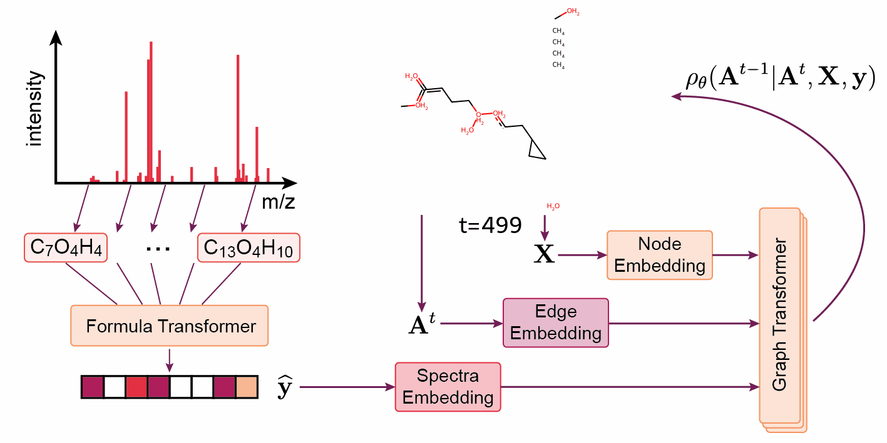

# DiffMS: Diffusion Generation of Molecules Conditioned on Mass Spectra



This is the codebase for our preprint [DiffMS: Diffusion Generation of Molecules Conditioned on Mass Spectra](https://arxiv.org/abs/2502.09571).

The DiffMS codebase is adapted from [DiGress](https://github.com/cvignac/DiGress). 

## Environment installation
This code was tested with PyTorch 2.3.1, cuda 11.8 and torch_geometrics 2.3.1

  - Download anaconda/miniconda if needed
  - Create a conda environment with rdkit:
    
    ```
    conda create -y -c conda-forge -n diffms rdkit=2024.09.4 python=3.9
    conda activate diffms
    ```

  - OR for a faster installation, you can use mamba:

    ```
    mamba create -y -n diffms rdkit=2024.09.4 python=3.9
    mamba activate diffms
    ```
    
  - Install a corresponding version of pytorch, for example: 
    
    ```pip install torch==2.3.1 --index-url https://download.pytorch.org/whl/cu118```

  - Run:
    
    ```pip install -e .```


## Dataset Download/Processing

We provide a series of scripts to download/process the pretraining and finetuning datasets. To download/setup the datasets, run the scripts in the data_processing/ folder in order:

```
bash data_processing/00_download_fp2mol_data.sh
bash data_processing/01_download_canopus_data.sh
bash data_processing/02_download_msg_data.sh
bash data_processing/03_preprocess_fp2mol.sh
```

These scripts use unzip, which can be installed with ```sudo apt-get install unzip``` on Linux. If you are on a different OS, you many need to edit these scripts or run the command manually.  

## Run the code
  
For fingerprint-molecule pretraining run [fp2mol_main.py](src/fp2mol_main.py). You will need to set the dataset in [config.yaml](configs/config.yaml) to 'fp2mol'. The primary pretraining dataset in our paper is referred to as 'combined' in the [fp2mol.yaml](configs/dataset/fp2mol.yaml) config. 

To finetune the end-to-end model on spectra-molecule generation, run [spec2mol_main.py](src/spec2mol_main.py). You will also need to set the dataset in [config.yaml](configs/config.yaml) to 'msg' for MassSpecGym or 'canopus' for NPLIB1. 

## Pretrained Checkpoints

We provide checkpoints for the end-to-end finetuned DiffMS model as well as the pretrained encoder/decoder weights [here](https://zenodo.org/records/15122968).

To load the pretrained DiffMS weights, set the load_weights argument in [general_default.yaml](configs/general/general_default.yaml) to the corresponding path. To use the pretrained encoder/decoder set the corresponding arguments in [general_default.yaml](configs/general/general_default.yaml).

## License

DiffMS is released under the [MIT](LICENSE.txt) license.

## Contact

If you have any questions, please reach out to mbohde@tamu.edu

## Reference
If you find this codebase useful in your research, please kindly cite the following manuscript
```
@article{bohde2025diffms,
  title={DiffMS: Diffusion Generation of Molecules Conditioned on Mass Spectra},
  author={Bohde, Montgomery and Manjrekar, Mrunali and Wang, Runzhong and Ji, Shuiwang and Coley, Connor W},
  journal={arXiv preprint arXiv:2502.09571},
  year={2025}
}
```
